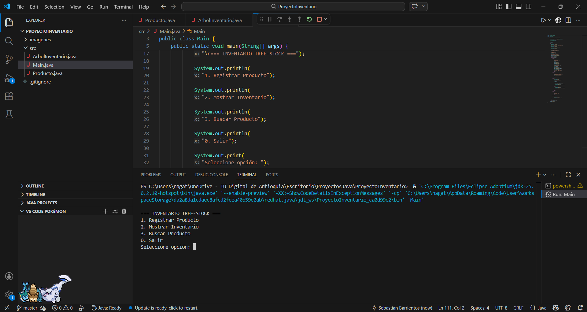
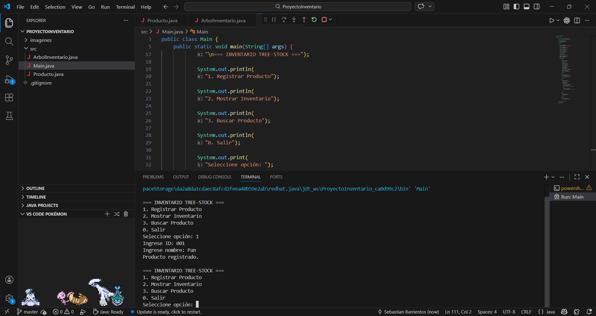
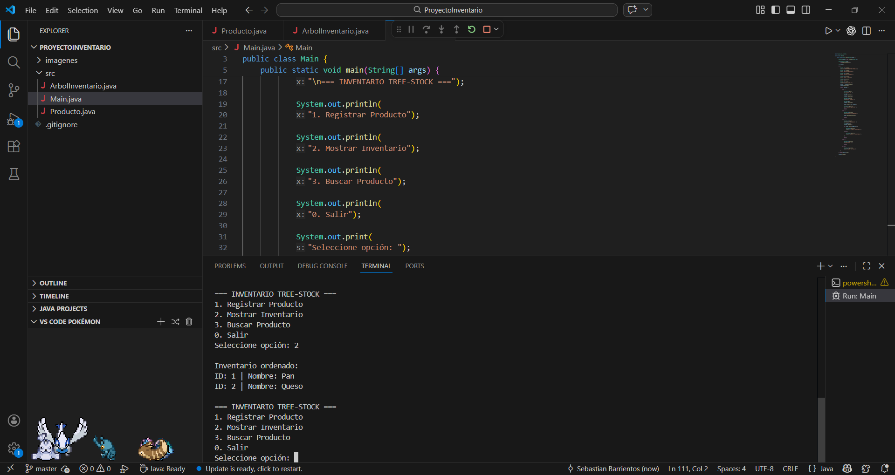
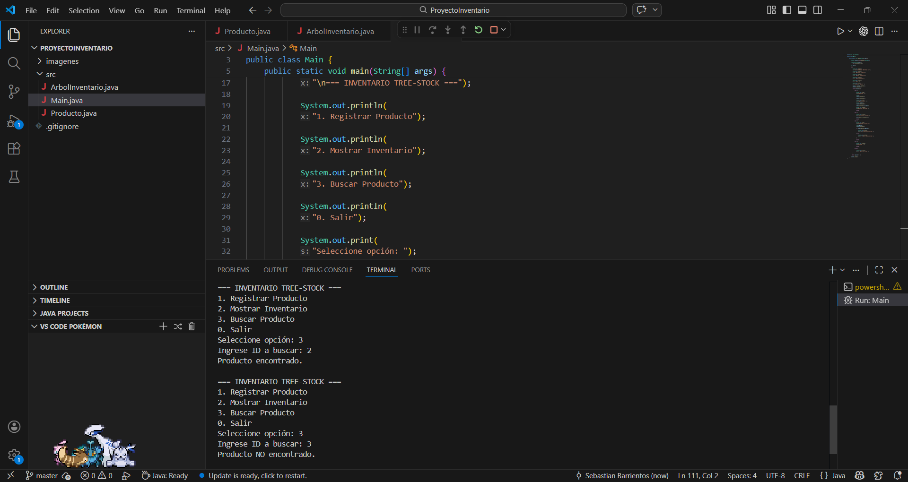

# ProyectoInventario - Tree-Stock

## Objetivo

Desarrollar un sistema de inventario utilizando un **árbol binario de búsqueda (BST)** en Java, permitiendo registrar productos, mostrarlos en orden y buscarlos por ID.

Este proyecto tiene como finalidad comprender la estructura lógica de los árboles binarios y su aplicación en sistemas reales de inventario.

---

## Descripción del Proyecto

El sistema "Tree-Stock" permite gestionar productos mediante un árbol binario de búsqueda.

Cada producto se almacena según su **ID**, manteniendo el inventario ordenado automáticamente.

El programa permite:

- Registrar productos
- Mostrar inventario ordenado
- Buscar productos por ID
- Gestionar datos mediante punteros izquierdo y derecho

---

## Estructura del Proyecto

ProyectoInventario
│
├── imagenes
│ ├── buscar.png
│ ├── menu.png
│ ├── mostrar.png
│ └── registrar.png
│
├── src
│ ├── ArbolInventario.java
│ ├── Main.java
│ └── Producto.java
│
├── .gitignore
└──  README.md

---

## Explicación de las Clases

### Producto.java

Representa un nodo del árbol binario.

Contiene:

- ID del producto
- Nombre del producto
- Puntero izquierdo
- Puntero derecho

Cada producto puede tener hijos a la izquierda o derecha.

---

### ArbolInventario.java

Contiene la lógica del árbol.

Métodos implementados:

**insertar()**

Inserta productos en el árbol de forma recursiva.

Si el ID es menor → izquierda  
Si el ID es mayor → derecha  

---

**mostrarInventario()**

Realiza recorrido **inorden**, mostrando los productos ordenados.

Orden:

Izquierda → Raíz → Derecha

---

**buscar()**

Busca un producto por ID usando recursividad.

---

### Main.java

Contiene el menú interactivo del sistema.

Opciones:

1. Registrar producto  
2. Mostrar inventario  
3. Buscar producto  
0. Salir  

---

## Cómo ejecutar el programa

1. Abrir terminal en la carpeta `src`

Compilar:

javac *.java

Ejecutar:

java Main

---

## Capturas de ejecución

### Menú principal

---

### Registro de producto

---

### Inventario ordenado

---

### Búsqueda de producto

---

## Video de sustentación

Enlace al video:

https://youtu.be/61CzAsSjISY

---

## Tecnologías utilizadas

- Java
- Git
- GitHub
- Visual Studio Code

---

## Autor

Sebastián Barrientos